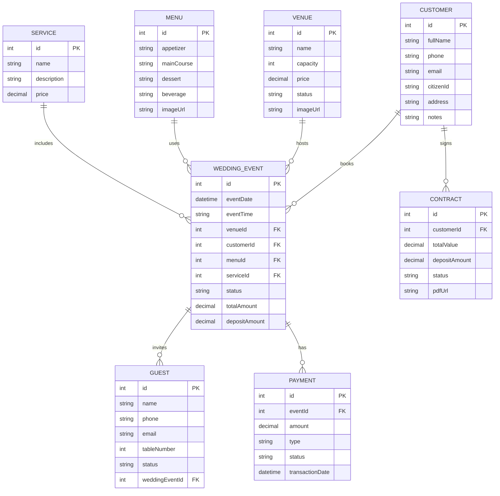

# ERD - Web Wedding Manager

## Core entities

- User
  - id
  - email
  - passwordHash
  - name
  - role
  - isActive

- Customer
  - id
  - fullName
  - phone
  - email
  - citizenId
  - address
  - notes

- Couple
  - id
  - brideName
  - groomName
  - birthDate
  - profession
  - photoUrl
  - facebook
  - notes

- Venue
  - id
  - name
  - capacity
  - price
  - status
  - imageUrl

- TableSetting
  - id
  - tableNumber
  - capacity
  - price
  - status

- Menu
  - id
  - appetizer
  - mainCourse
  - dessert
  - beverage
  - imageUrl

- Service
  - id
  - name
  - description
  - price

- WeddingEvent
  - id
  - eventDate
  - eventTime
  - venueId
  - customerId
  - menuId
  - serviceId
  - status
  - totalAmount
  - depositAmount

- Guest
  - id
  - name
  - phone
  - email
  - tableNumber
  - status
  - weddingEventId

- Contract
  - id
  - customerId
  - totalValue
  - depositAmount
  - status
  - pdfUrl

- Payment
  - id
  - eventId
  - amount
  - type
  - status
  - transactionDate

## Relationships

- Customer 1 --- * WeddingEvent
- Venue 1 --- * WeddingEvent
- Menu 1 --- * WeddingEvent
- Service 1 --- * WeddingEvent
- WeddingEvent 1 --- * Guest
- WeddingEvent 1 --- * Payment
- Customer 1 --- * Contract

## Mermaid diagram

